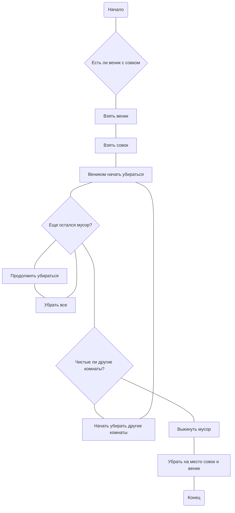
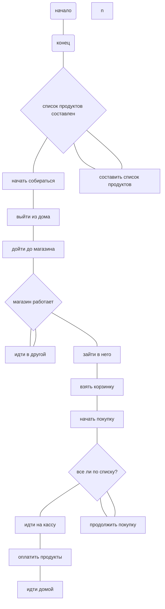

```mermaid
flowchart TD

    v(Начало)

    v --- k{Есть ли веник с совком}

    k --- a[Взять веник] --- b[Взять совок]

    b --- c[Веником начать убираться]

    c --- d{Еще остался мусор?}

    d --- s[Продолжить убираться]

    d ----- f{Чистые ли другие комнаты?}

    s --- i[Убрать все]

    d --- i

    f --- j[Начать убирать другие комнаты]

    f --- h[Выкинуть мусор]

    h --- g[Убрать на место совок и веник]

    j --- c

    g --- n(Конец)
```
![[Pasted image 20260904131239.png]]

```mermaid
flowchart TD

    q(начало)

    w(конец)

    e{список продуктов составлен}

    a[начать собираться]

    s[составить список продуктов]

    d[выйти из дома]

    z[дойти до магазина]

    x{магазин работает}

    c[идти в другой]

    r[зайти в него]

    t[взять корзинку]

    y[начать покупку]

    f{все ли по списку?}

    g[идти на кассу]

    h[продолжить покупку]

    v[оплатить продукты]

    b[идти домой]

    n

    q --- w

    w --- e

    e --- a

    e --- s

    s --- e

    a --- d

    d --- z

    z --- x

    x --- c

    c --- x

    x --- r

    r --- t

    t --- y

    y --- f

    f --- g

    g --- v

    v --- b

    f --- h

    h --- f
```

![[Pasted image 20260904132907.png]]

