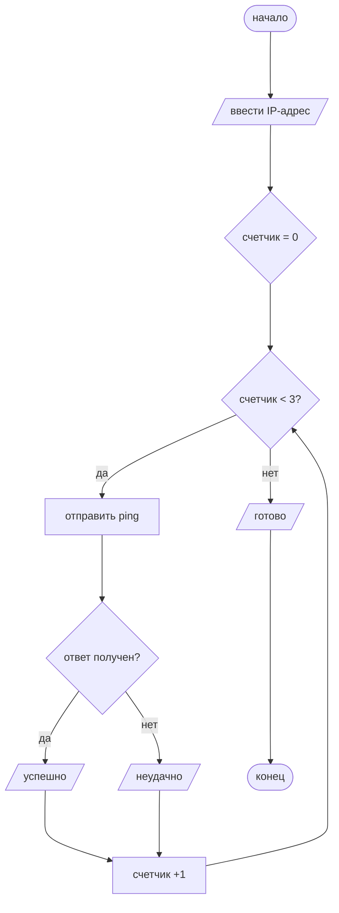
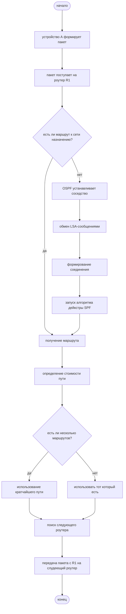
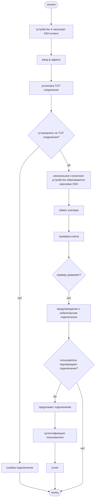

Задание 1

```mermaid
flowchart TD

    a([начало]) --->b[/ввести IP-адрес/]

    b --->c{счетчик = 0}

    c --->q{счетчик < 3?}

    q --да-->w[отправить ping]

    w --->e{ответ получен?}

    e --да-->r[/успешно/]

    e --нет-->t[/неудачно/]

    r ---> y[счетчик +1]

    t --->y

    y --->q

    q --нет--> o[/готово/]

    o ----> f([конец])
```

Задание 2 

```mermaid
flowchart TD

     a([начало]) --->b[устройство А формирует пакет]

     b --->c[пакет поступает на роутер R1]

     c --->d{есть ли маршрут к сети назначению?}

     d --нет-->e[OSPF устанавливает соседство]

     e --->f[обмен LSA-сообщениями]

     f --->g[формирование соединения]

     g --->h[запуск алгоритма дейкстры SPF]

     d --да-->i[получение маршрута]

     h --->i

     i --->j[определение стоимости пути]

     j --->k{есть ли несколько маршрутов?}

     k --да-->l[использование кратчайшего пути]

     k --нет-->m[использовать тот который есть]

     l --->n[поиск следующего роутера]

     m --->n

     n --->o[передача пакета с R1 на слудеющий роутер]

     o --->p([конец])
```
![[Pasted image 20260910100421.png]]

Задание 3

```mermaid
flowchart TD

    a([начало]) --->b[устройство А запускает SSH-клиент]

    b --->c[ввод ip адреса]

    c --->d[установка TCP соединения]

    d --->e{установлено ли TCP соединения?}

    e --нет-->f[ошибка подключения]

    e --да-->g[изначальное и конечное устройство обмениваются версиями SSH]

    g --->h[обмен ключами]

    h --->i[проверка ключа]

    i --->j{серверу доверяют?}

    j --нет-->k[предупреждение о небезопасном подключении]

    k --->l{пользователь подтверждает подключение?}

    l --да-->m[продолжает подключение]

    m --->n[аутентификация пользователя]

    n --->z[успех]

    z --->y([конец])

    f --->y

    l --нет-->y
```
![[Pasted image 20260910101735.png]]

