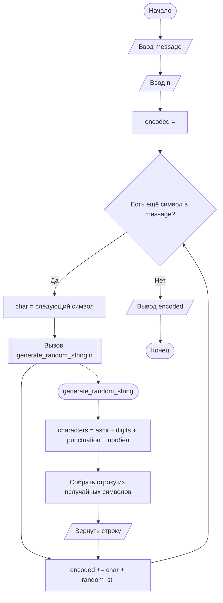

```mermaid
flowchart TD

    a([Начало]) --> s[/Ввод message/]

    s --> d[/Ввод n/]

    d --> z[encoded = ""]

    z --> x{Есть ещё символ в message?}

    x -- Да --> c[char = следующий символ]

    c --> q[[Вызов generate_random_string n]]

    q --> w[encoded += char + random_str]

    w --> x

    x -- Нет --> e[/Вывод encoded/]

    e --> r([Конец])

    q -.-> t([generate_random_string])

    t --> y[characters = ascii + digits + punctuation + пробел]

    y --> f[Собрать строку из nслучайных символов]

    f --> g[/Вернуть строку/]

    g -.-> w
```
