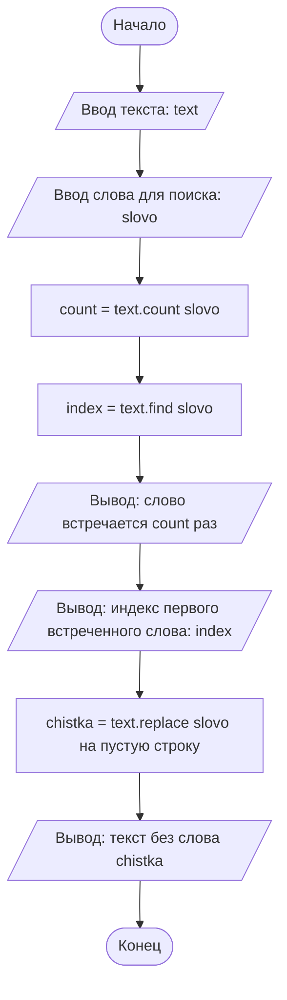

```mermaid
	flowchart TD

    Start([Начало]) --> Input1[/Ввод текста: text/]

    Input1 --> Input2[/Ввод слова для поиска: slovo/]

    Input2 --> Count[count = text.count slovo]

    Count --> Find[index = text.find slovo]

    Find --> Output1[/Вывод: слово встречается count раз/]

    Output1 --> Output2[/Вывод: индекс первого встреченного слова: index/]

    Output2 --> Replace[chistka = text.replace slovo на пустую строку]

    Replace --> Output3[/Вывод: текст без слова chistka/]

    Output3 --> End([Конец])
```
